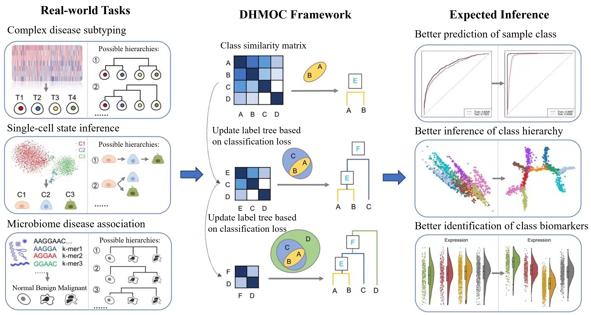

# DHMOC: a data-driven hierarchical learning framework for multi-class omics data classification

*Linping Wang, Jiemin Xie, Lei Ba, Jiarong Wu, Keyi Li, Xuemei Liu, Yunhui Xiong, Li C. Xia,***

## Summary
We proposed the method of data-driven hierarchical learning framework for multi-class omics data classification (DHMOC), interlacing classification error minimization with successive label clustering, thus enables automatic and simultaneous learning of both class hierarchy and sample labels. We evaluated DHMOC on a number of simulated and real-world multi-omics datasets, including complex disease, microbiome, single-cell and spatial transcriptomics data. The benchmark demonstrated DHMOC’s high performance in classification accuracy, as well in inferring the true biological hierarchy.

The repository contains all the data and code (https://github.com/labxscut/DHMOC/tree/DHMOC/code) used in this study, as well as some important results (please refer to the figures(https://github.com/labxscut/DHMOC/tree/main/Figures).

## Installation

*******

## Data 

We simulated 28 datasets and downloaded six real-world multi-omics datasets for benchmark. Details of the real-world datasets are given below:

* ① Breast and gastric cancer data were downloaded from The Cancer Genome Atlas (TCGA) and the Molecular Taxonomy of Breast Cancer International Consortium (METABRIC), including mutation, copy number aberration and methylation data, and through both the cBioPortal (https://www.cbioportal.org/) and the TCGA data portal.

* ② Colon cancer microbiome data was downloaded from the ENA database (PRJEB7774).

* ③ Gastric cancer cell line NCI-N87 scRNA-seq data was downloaded from Gene Expression Omnibus (GSE142750) and National Institute of Health’s SRA (PRJNA498809).

* ④ Lymphoid cell scRNA-seq data was downloaded from human Ensemble Cell Atlas (hECA) system.

* ⑤ Liver cancer spatial transcriptome data was downloaded from the HCCDB database (Integrative Molecular Database of Hepatocellular Carcinoma).

These datasets all come with sample- or cell-level multi-omics profiles and known biological labels, such as disease subtype, cell lineage and disease status.

All of the pre-processed datasets can be found [here](https://github.com/labxscut/DHMOC/releases/tag/DHMOC_Data).

## Code

The dependencies required are R. All of the codes can be found [here](https://github.com/labxscut/DHMOC/tree/main/Code).

The code base structure is explained below:

* **[Simulation_Data_Generation.R](https://github.com/labxscut/DHMOC/tree/main/Code/1.Simulation_Data_Generation.R)**: script for generating the simulation data.
* **[Simulation_Data_Variability_Evaluation.R](https://github.com/labxscut/DHMOC/tree/main/Code/2.Simulation_Data_Variability_Evaluation.R)**: script for evaluating the effect of data variability to the simulation data.
* **[Real_World_Data_Hierarchy_Learning.R](https://github.com/labxscut/DHMOC/tree/main/Code/3.Real_World_Data_Hierarchy_Learning.R)**: script for learning the hierarchies of real-world datasets.

# Contact & Support:

* Li C. Xia: email: [lcxia@scut.edu.cn](mailto:lcxia@scut.edu.cn)
* Jiemin Xie: email: [202120130808@mail.scut.edu.cn](mailto:202120130808@mail.scut.edu.cn)
